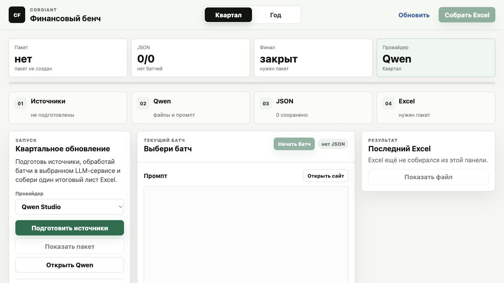
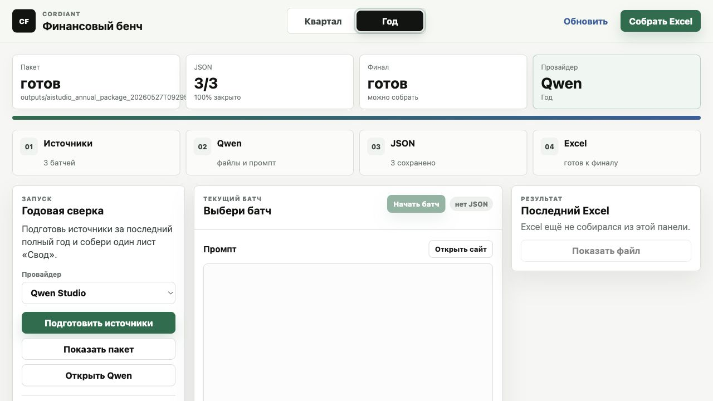
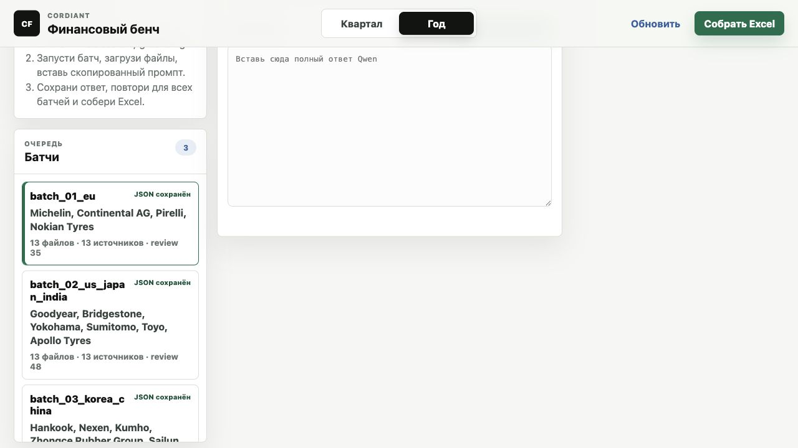

# Cordiant Tire Financial Benchmark Console

Локальная панель для обновления Excel-бенча финансовой отчетности шинных производителей. Проект готовит официальные источники, проводит пользователя через Qwen / Google AI Studio / другой LLM-сервис, принимает JSON-ответы модели и собирает новую Excel-книгу с одним листом `Свод`.

Исходная книга не перезаписывается. Все результаты создаются как новые файлы в `outputs/`.



## Установка на чистую Windows

Подходит для Windows 10/11.

### 1. Скачайте проект

С GitHub нажмите `Code` -> `Download ZIP`, распакуйте архив в обычную папку, например:

```text
C:\CordiantBenchmark
```

Не запускайте проект прямо из ZIP-архива. Его нужно именно распаковать.

### 2. Установите Python

1. Откройте [python.org/downloads/windows](https://www.python.org/downloads/windows/).
2. Скачайте Python `3.11` или `3.12`.
3. Запустите установщик.
4. На первом экране обязательно включите галочку `Add python.exe to PATH`.
5. Нажмите `Install Now`.
6. Дождитесь завершения установки.

Если галочку `Add python.exe to PATH` забыли включить, проще удалить Python и поставить заново с этой галочкой.

### 3. Проверьте исходный Excel

В нормальном публичном репозитории исходный workbook уже лежит в корне проекта:

```text
Бенч финансовой отчетности_мэйджоры.xlsx
```

Не удаляйте и не переименовывайте его: это чистый одно-листовый шаблон `Свод`, по которому собирается финальный результат. В шаблоне должны оставаться структура, стили и заголовки, но не заполненные финансовые значения. Если вы работаете с другой версией шаблона, замените этот файл новым workbook с тем же именем и одним листом `Свод`.

### 4. Установите зависимости

Дважды щелкните:

```text
install_windows_requirements.cmd
```

Откроется черное окно. Не закрывайте его, пока оно не напишет:

```text
Installed. Use start_dashboard.cmd or the prepare/update .cmd launchers.
```

После этого нажмите любую клавишу.

### 5. Запустите панель

Дважды щелкните:

```text
start_dashboard.cmd
```

Откроется локальная страница в браузере. Обычно это:

```text
http://127.0.0.1:8787/
```

Если порт `8787` занят, панель сама попробует следующий свободный порт.

### Быстро обновить установленную папку

Для уже распакованной/установленной папки можно обновиться без входа в GitHub:

```text
update_from_github.cmd
```

Скрипт использует публичный GitHub. Если папка является Git-клоном, он выполнит HTTPS `git pull`; если проект был скачан ZIP-архивом, он скачает свежий ZIP `main` и наложит файлы поверх текущей папки. Локальные `.venv` и `outputs` не удаляются.

## Установка на чистый Mac

Подходит для macOS на Apple Silicon и Intel.

### 1. Скачайте проект

С GitHub нажмите `Code` -> `Download ZIP`, распакуйте архив, например в:

```text
~/Documents/CordiantBenchmark
```

Не запускайте файлы прямо из ZIP-архива.

### 2. Установите Python

Самый простой путь:

1. Откройте [python.org/downloads/macos](https://www.python.org/downloads/macos/).
2. Скачайте Python `3.11` или `3.12`.
3. Откройте `.pkg`-установщик и пройдите обычную установку.

Если Python уже установлен, этот шаг можно пропустить.

### 3. Проверьте исходный Excel

В корне проекта уже должен лежать файл:

```text
Бенч финансовой отчетности_мэйджоры.xlsx
```

Это часть проекта и дефолтный чистый одно-листовый шаблон `Свод` для сборки результата. Если workbook называется иначе, переименуйте его в это имя для работы через дашборд. CLI-скрипты также поддерживают параметр `--workbook`, но самый простой пользовательский путь ожидает стандартное имя.

### 4. Установите зависимости

Дважды щелкните:

```text
install_macos_requirements.command
```

Если macOS не разрешает открыть файл, сделайте один из вариантов:

```bash
cd ~/Documents/CordiantBenchmark
chmod +x *.command scripts/*.sh
./install_macos_requirements.command
```

Если macOS пишет, что файл скачан из интернета и заблокирован, можно снять quarantine-флаг для папки проекта:

```bash
cd ~/Documents/CordiantBenchmark
xattr -dr com.apple.quarantine .
```

После успешной установки появится локальная папка `.venv` с Python-зависимостями.

### 5. Запустите панель

Дважды щелкните:

```text
start_dashboard.command
```

Откроется локальная страница в браузере. Обычно это:

```text
http://127.0.0.1:8787/
```

Если страница не открылась сама, посмотрите адрес в открывшемся Terminal-окне и вставьте его в браузер.

## Что еще нужно кроме проекта

- Интернет, потому что скрипты скачивают официальные отчеты, PDF, IR-страницы и регуляторные источники.
- Браузер: Chrome, Edge, Safari, Brave или другой современный браузер.
- Аккаунт в выбранном LLM-сервисе. По умолчанию используется Qwen Studio, но в панели можно выбрать Google AI Studio, Kimi, Xiaomi MiMo или DeepSeek.
- Microsoft Excel, LibreOffice или другой просмотрщик `.xlsx`, чтобы открыть итоговую книгу.
- Исходный чистый одно-листовый workbook `Бенч финансовой отчетности_мэйджоры.xlsx`; в дефолтной поставке он лежит прямо в репозитории.

API-ключи не нужны для обычного ручного сценария через веб-интерфейс LLM.

## Самый простой сценарий через дашборд

1. Запустите `start_dashboard.cmd` на Windows или `start_dashboard.command` на Mac.
2. Вверху выберите режим: `Квартал` или `Год`.
3. Выберите провайдера. Если не знаете, оставьте `Qwen Studio`.
4. Нажмите `Подготовить источники`.
5. Дождитесь, пока появятся батчи.
6. Нажмите `Начать батч`.
7. Панель откроет папку `FILES_FOR_AI_STUDIO` и скопирует промпт в буфер обмена.
8. В выбранном LLM-сервисе отключите web search / grounding, если такой переключатель есть.
9. Загрузите в LLM все файлы из открытой папки `FILES_FOR_AI_STUDIO`.
10. Вставьте промпт из буфера обмена в чат LLM.
11. Дождитесь ответа модели.
12. Скопируйте полный ответ модели и вставьте его в поле `Ответ ...` в дашборде.
13. Нажмите `Сохранить и дальше`.
14. Повторите шаги для всех батчей.
15. Когда счетчик JSON станет, например, `3/3`, нажмите `Собрать Excel`.
16. Нажмите `Показать файл` и откройте готовый workbook.





Важно: загружайте в LLM только файлы из `FILES_FOR_AI_STUDIO`. Не загружайте `source_manifest.json`, `aistudio_latest_quarter_schema.json`, `FILES_TO_UPLOAD.txt` и `prompt_for_aistudio.txt`; нужная структура уже встроена в промпт.

Правило размера батча: сначала выберите провайдера, потом нажимайте `Подготовить источники`. Дашборд соберет батчи под лимит выбранного web-интерфейса: для Qwen — до 5 файлов на батч, для Kimi — до 50, для DeepSeek — до 20, для MiMo — безопасные 5, для Google AI Studio жёсткий лимит файлов не ставится и остается прежний контроль по объему входа. Дополнительно генератор считает примерный объем промпта плюс файлов и целится в 64k входных токенов на батч с допуском примерно +/- 10%.

## Что получится на выходе

Итоговые файлы появляются в папке `outputs/`.

Для квартального режима:

```text
outputs/aistudio_quarterly_excel_update_*/Бенч финансовой отчетности_мэйджоры_aistudio_quarterly_update_*.xlsx
outputs/aistudio_quarterly_excel_update_*/*_provenance.json
```

Для годового режима:

```text
outputs/aistudio_annual_excel_update_*/Бенч финансовой отчетности_мэйджоры_aistudio_annual_update_*.xlsx
outputs/aistudio_annual_excel_update_*/*_provenance.json
```

Excel-файл содержит один лист `Свод` в формате исходного бенча. Исходный workbook в репозитории тоже содержит только этот лист; отдельные листы компаний не нужны для пользовательского workflow. Обновленные значения получают комментарии с источниками, а рядом сохраняется machine-readable provenance JSON.

## Режимы

`Квартал` ищет последний самостоятельный опубликованный квартал по каждой компании. Это не YTD, не 9M и не full year.

`Год` ищет последний полный финансовый год. Годовой режим блокирует квартальные, interim, H1, 9M, YTD и TTM ответы.

Если компания отчиталась позже остальных, provenance может содержать предупреждения о периоде. Такие значения стоит проверять вручную.

## Ручной сценарий без дашборда

Обычно он не нужен, но полезен для диагностики.

### Windows

Подготовить квартальные источники:

```bat
prepare_quarterly_sources.cmd
```

Подготовить годовые источники:

```bat
prepare_annual_sources.cmd
```

Собрать квартальный Excel из сохраненных JSON:

```bat
update_quarterly_excel_from_aistudio.cmd
```

Собрать годовой Excel:

```bat
update_annual_excel_from_aistudio.cmd
```

### macOS

Подготовить квартальные источники:

```bash
./prepare_quarterly_sources.command
```

Подготовить годовые источники:

```bash
./prepare_annual_sources.command
```

Собрать квартальный Excel:

```bash
./update_quarterly_excel_from_aistudio.command
```

Собрать годовой Excel:

```bash
./update_annual_excel_from_aistudio.command
```

### CLI напрямую

После установки зависимостей можно запускать Python напрямую:

```bash
.venv/bin/python scripts/dashboard_server.py --open
.venv/bin/python scripts/prepare_aistudio_sources.py --mode quarterly --download-mode full
.venv/bin/python scripts/prepare_aistudio_sources.py --mode annual --download-mode full
.venv/bin/python scripts/apply_aistudio_json.py --mode quarterly
.venv/bin/python scripts/apply_aistudio_json.py --mode annual
```

На Windows путь к Python такой:

```bat
.venv\Scripts\python.exe scripts\dashboard_server.py --open
.venv\Scripts\python.exe scripts\prepare_aistudio_sources.py --mode quarterly --download-mode full
.venv\Scripts\python.exe scripts\prepare_aistudio_sources.py --mode annual --download-mode full
.venv\Scripts\python.exe scripts\apply_aistudio_json.py --mode quarterly
.venv\Scripts\python.exe scripts\apply_aistudio_json.py --mode annual
```

Если провайдер не справляется с большими батчами, подготовьте батчи по одной компании:

```bash
.venv/bin/python scripts/prepare_aistudio_sources.py --mode quarterly --download-mode full --max-companies-per-batch 1
```

На Windows:

```bat
.venv\Scripts\python.exe scripts\prepare_aistudio_sources.py --mode quarterly --download-mode full --max-companies-per-batch 1
```

## Структура проекта

```text
.
├── config/company_source_registry.json       # список компаний и источников
├── docs/                                     # документация и скриншоты
├── scripts/dashboard_server.py               # локальный веб-сервер панели
├── scripts/prepare_aistudio_sources.py       # подготовка source-пакетов
├── scripts/apply_aistudio_json.py            # сборка итогового Excel
├── templates/                                # JSON-схема и шаблон промпта
├── web/                                      # HTML/CSS/JS дашборда
├── install_windows_requirements.cmd          # установка зависимостей на Windows
├── install_macos_requirements.command        # установка зависимостей на Mac
├── start_dashboard.cmd                       # запуск панели на Windows
├── start_dashboard.command                   # запуск панели на Mac
└── requirements.txt                          # Python-зависимости
```

## Что можно и нельзя коммитить в публичный GitHub

Коммитить можно:

- код в `scripts/`, `web/`, `templates/`, `config/`;
- `README.md`, `LICENSE`, `requirements.txt`;
- исходный одно-листовый workbook `Бенч финансовой отчетности_мэйджоры.xlsx`;
- документацию и специально подготовленные скриншоты в `docs/`.

Не коммитьте без отдельной проверки:

- `.env`, API-ключи, токены, пароли;
- `outputs/` и все сгенерированные Excel/JSON/PDF/PNG;
- другие `.xlsx`/`.xlsm`/`.xls` файлы, если это не осознанное обновление исходного бенча;
- локальные кэши `.venv/`, `.playwright-*`, `__pycache__/`;
- внутренние рабочие материалы `.Codex/`.

`.gitignore` уже настроен так, чтобы эти файлы случайно не попали в публичный репозиторий.

Код распространяется по MIT License. Исходный workbook входит в репозиторий как чистый шаблон для этого workflow, без заполненных benchmark-значений. Скачанные отчеты компаний и сторонние документы не становятся частью лицензии репозитория; для них действуют права соответствующих владельцев и источников.

## Частые проблемы

### Windows пишет, что Python не найден

Переустановите Python с [python.org](https://www.python.org/downloads/windows/) и включите галочку `Add python.exe to PATH`. Потом снова запустите `install_windows_requirements.cmd`.

### Mac не открывает `.command`

Запустите в Terminal:

```bash
cd ~/Documents/CordiantBenchmark
chmod +x *.command scripts/*.sh
xattr -dr com.apple.quarantine .
```

Потом снова откройте `install_macos_requirements.command` или `start_dashboard.command`.

### Панель не открылась в браузере

Посмотрите окно Terminal или Command Prompt. Там должен быть адрес вида:

```text
http://127.0.0.1:8787/
```

Скопируйте его в браузер. Если `8787` занят, сервер попробует следующие порты.

### Кнопка `Собрать Excel` неактивна

Не все батчи сохранены. Счетчик JSON должен стать `N/N`, например `3/3`.

### Дашборд пишет `JSON не найден`

Скопируйте полный ответ модели. Можно вставлять JSON в Markdown-блоке, массив компаний или один объект компании, но в ответе модели должен быть читаемый JSON.

### Дашборд пишет, что ответ похож на другой батч

Выбран один батч, а вставлен ответ по другой компании или группе компаний. Откройте правильный батч и вставьте ответ туда.

### В Windows нет `OPEN_THIS_QUARTERLY_PACKAGE`

Это нормально. Windows может блокировать symlink-папки без Developer Mode. Дашборд и `.cmd`-файлы используют portable path-файлы в `outputs/latest_aistudio_*_package_path.txt`, поэтому workflow не зависит от symlink.

### LLM-сервис падает на большом батче

Повторите подготовку с меньшими батчами:

```bash
.venv/bin/python scripts/prepare_aistudio_sources.py --mode quarterly --download-mode full --max-companies-per-batch 1
```

На Windows:

```bat
.venv\Scripts\python.exe scripts\prepare_aistudio_sources.py --mode quarterly --download-mode full --max-companies-per-batch 1
```

### Итоговый Excel не появился

Проверьте:

1. исходный workbook лежит в корне проекта;
2. JSON сохранен для всех батчей;
3. папка `outputs/` доступна для записи;
4. Excel-файл не открыт в другом приложении во время сборки.

## Для разработчиков

Проверить Python-синтаксис:

```bash
python3 -m compileall -q scripts
```

Запустить локальную панель без автозапуска браузера:

```bash
.venv/bin/python scripts/dashboard_server.py
```

Открыть статус API:

```text
http://127.0.0.1:8787/api/status
```

Проверочный Goodyear SEC proof:

```bash
.venv/bin/python scripts/goodyear_sec_dry_run.py
```
